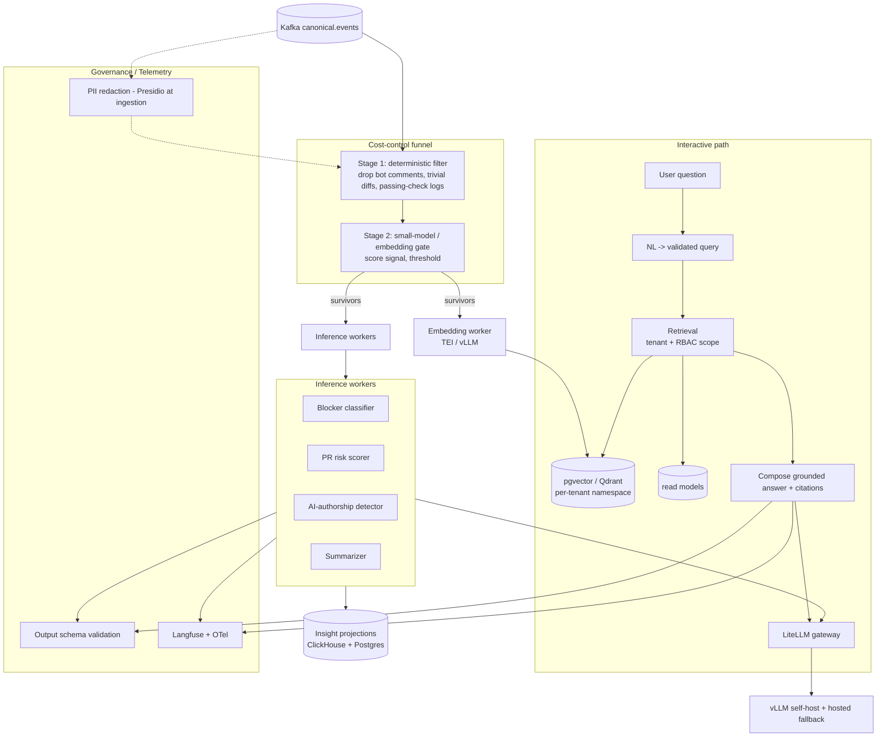

# AI-ARCHITECTURE — Dev Intelligence Platform (GitHub-only)

The production AI subsystem. Detailed requirements + acceptance criteria: [`requirements/ai-layer-requirements.md`](requirements/ai-layer-requirements.md). This is the *design* that satisfies them.

**Governing principle:** most inference is **precompute** (async, event-driven). Untrusted input is **GitHub text** (PR/issue/review/commit/comment bodies, CI logs). The text firehose to funnel = CI logs + comments.

## 1. AI dataflow



## 2. Inference pipeline (precompute)

- **Trigger:** each canonical event enqueues relevant jobs (Temporal for multi-step; Kafka consumer groups for simple scoring).
- **Funnel (AI-1.2):** Stage 1 deterministic drops (bot/automation comments, trivial edits, logs of passing checks). Stage 2 small-model/embedding gate; only above-threshold text reaches the LLM. Target **< 5% of comment/CI-log volume** hits an LLM.
- **Workers:** blocker classification, **PR risk scoring** (pillar 6), **AI-authorship detection** (pillar 7), summarization. Output **upserted as insight projections**, idempotent by `(tenant_id, event_id, model_version, prompt_version)`.
- **Backpressure (AI-1.4):** interactive prioritized over batch; overload sheds/defers batch; per-tenant fair scheduling.

## 3. Embeddings & vectors

- Eligible content (PRs, issues, review threads; funnel-passed comments) chunked content-type-aware (code diff vs. prose vs. thread); embedded via TEI/vLLM (bge/e5); model version stored per vector.
- **Isolation (AI-2.2):** per-tenant namespace (Qdrant) or partition + RLS (pgvector) — structural, not by convention.
- **Lifecycle (AI-2.3):** source update re-embeds/replaces; tenant/repo deletion purges vectors; model upgrade → resumable re-embed.
- **Portability (ADR-004):** pgvector MVP → Qdrant at scale, behind a retrieval interface.

## 4. Retrieval / RAG

- **Two-level authorization (AI-3.1):** retrieval filter = tenant boundary **AND** the user's RBAC scope predicate, injected by the framework.
- **Hybrid + rerank (AI-3.3):** vector + BM25 (OpenSearch) → reranker; precision@k tracked, regressions gate releases.
- **Grounding (AI-3.2):** cite specific PRs/reviews/issues/CI runs with source URLs; ungrounded answers suppressed/flagged.
- **Budgeting (AI-3.4):** context budgeter caps + prioritizes; truncation logged.

## 5. Model gateway & routing

- **LiteLLM** single gateway; provider/model swap = config; ≥1 self-hostable model (Llama-class via vLLM) wired end-to-end.
- **Routing (AI-4.1):** high-volume classification → small/local; summarization/chat → larger. Config-driven.
- **Fallback / breaker (AI-4.3):** primary failure → fallback; repeated failures → cached/last-known.
- **Versioning + canary (AI-4.4):** model+prompt version on every inference/projection; canary cohort gated by eval+cost; one-click rollback.

## 6. NL → validated query (interactive)

```mermaid
sequenceDiagram
    participant U as User
    participant NLQ as NL->Query (LLM)
    participant V as Schema validator
    participant DAL as Data-access (tenant+scope)
    participant RM as Read models
    participant C as Composer (LLM)
    U->>NLQ: "why did the auth refactor stall?"
    NLQ->>V: structured query object (DSL, NOT SQL)
    V->>V: validate; reject if malformed
    V->>DAL: query + (tenant_id, scope injected by system)
    DAL->>RM: execute scoped query
    RM-->>C: rows + retrieved context
    C->>U: grounded answer + citations
```
Model never emits raw SQL and never supplies tenant/scope — the system injects them (AI-6.1, AI-7.1).

## 7. Safety & governance

- **Prompt injection (AI-7.1):** PR/issue/commit/comment text is untrusted. Instruction/data separation (data structurally fenced); no tool/query/action from content; red-team injection suite (payloads embedded in PR/comment bodies) in CI.
- **PII (AI-7.2):** Presidio redaction at ingestion, before embed/prompt; verified on labeled set; redaction events logged (type only).
- **Output validation (AI-7.3):** schema-conformant or reject/retry; numeric fields sanity-checked.
- **Hallucination guardrails (AI-7.4):** unsupported claims withheld/low-confidence; rate tracked on evals.
- **Jailbreak resistance (AI-7.5):** refuse system-prompt/other-tenant probes; regression suite.

## 8. Telemetry, evals, feedback

- **Cost (AI-8.1):** tokens/model/cost per inference, per tenant/feature; spike alerts; budgets.
- **Tracing/audit (AI-8.2):** inputs (or hash), retrieved refs, prompt+model version, output, latency, cost, scope. OTel + Langfuse.
- **Eval gating CI (AI-8.3):** golden datasets per feature; prompt/model change runs evals; regression blocks merge.
- **Drift (AI-8.4):** input/output drift monitored; sampled prod re-scored.
- **Feedback (AI-8.5/8.6):** thumbs + dismiss reasons → eval sets + fine-tuning; corpora provably free of cross-tenant data; lineage auditable.

## 9. Pillar-specific AI models

### 9.1 PR risk scoring (pillar 6)
- Features: PR size (files/additions), review depth, author history, CI signal, files-touched hotspots.
- **Explainable** (top factors surfaced); **backtested** against historical reverts (AUC/precision on eval set, AI-9.1).
- Starts as a gradient-boosted model on structured features (cheap, no LLM); LLM only for the natural-language "why" summary. Good cost/quality split to articulate.

### 9.2 AI-authorship impact (pillar 7)
- Detect AI-generated PRs/commits via metadata + `Co-authored-by` trailers + heuristics; confidence-scored (AI-10.1).
- Correlate authorship with rework/revert/cycle-time as a tenant-scoped read model (AI-10.2).

## 10. Proactive insight engine

- Background scans (scheduled + streamed) produce entity-tied insights with severity + confidence + evidence.
- **Noise control (AI-5.2):** dedup near-duplicate causes; cap volume; rank by severity×confidence; dismissed cause doesn't re-fire.
- Written to the same `insight` projection dashboards + feed read — one materialization, many surfaces.

## 11. Why this is production-grade (interview anchors)

Precompute + funnel (cost) · two-level scoped retrieval + RLS (isolation) · instruction/data separation + validated-query (injection/exfiltration) · per-tenant cost + eval-gated CI (telemetry/quality) · vector purge + training lineage (governance) · **risk model backtested on real reverts** (AI tied to a measurable outcome). Each maps to a requirement ID + acceptance test.
