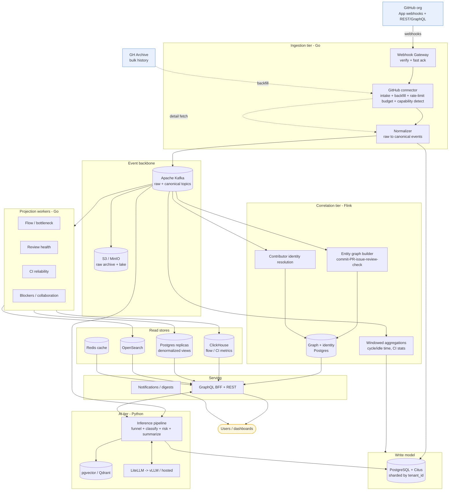
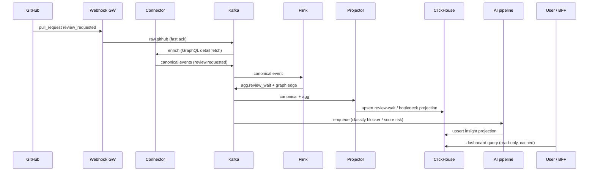
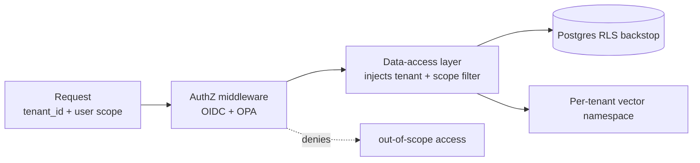

# ARCHITECTURE — Dev Intelligence Platform (GitHub-only)

System design. Locked OSS stack (see `../CLAUDE.md`). Event-driven, CQRS, polyglot persistence, multi-tenant. Single source (GitHub) with a source-agnostic seam. Diagrams are Mermaid.

## 1. Design tenets

1. **The canonical model is the product.** Ingest GitHub completely, normalize once (write side); every pillar is a projection (read side).
2. **Signal discipline.** Build metrics only on STRONG GitHub signals; capability-gate the rest; exclude thin signals (PRD §6).
3. **Precompute over request-time.** Insights + AI scoring computed on ingestion events, served from materialized read models.
4. **Isolation in depth.** Tenant + RBAC scoping at the app layer, Postgres RLS backstop, per-tenant vector namespaces.
5. **Rebuildable.** Any read model rebuilt by replaying the Kafka log (raw events archived in S3).
6. **Source-agnostic, single-source impl.** Canonical events + pluggable connector interface; only GitHub built (ADR-001).

## 2. High-level architecture

## 3. Tiers

### 3.1 Ingestion (Go)
- **Webhook Gateway** terminates GitHub App webhooks, verifies HMAC, writes to Kafka `raw.github` immediately (fast ack).
- **GitHub connector** owns App installation tokens, **rate-limit budgeting** across REST points + GraphQL point cost, detail fetches (a webhook often needs a follow-up GraphQL query for full context), **capability detection** (does this repo emit deployments/releases? → gates DORA metrics), and **backfill** — live history via API, bulk history via **GH Archive** (Temporal-orchestrated, resumable). Reconciles GH Archive records with API truth.
- **Normalizer** maps GitHub payloads → canonical events on `canonical.events`. Idempotency: `(delivery_id)` for webhooks, `(repo, node_id, updated_at)` for fetched entities.

### 3.2 Correlation (Apache Flink)
Two stateful jobs:
- **Entity graph builder** — links the intra-GitHub graph: PR↔commits (PR commit list), PR↔issue (`closes #`, `Refs:` trailers, timeline cross-refs), commit↔check-run (head SHA), review↔PR. Emits edges with confidence.
- **Contributor identity resolution** — unifies actors across commit author/committer emails, GitHub logins, and noreply addresses; classifies bots/automation (`[bot]` suffix, known apps). Emits a stable `contributor_id` mapping with confidence.
- **Windowed aggregations** — time-in-stage, idle time, CI pass/flake stats over the work-item state machine.
Deterministic & replayable: replaying the log rebuilds graph + identity map identically.

### 3.3 Write model (PostgreSQL + Citus)
Canonical entities (`work_item`, `contributor`, `review`, `check_run`, `state_transition`, `entity_edge`, `identity_link`) sharded by `tenant_id`. Source of truth; not queried by dashboards directly.

### 3.4 Read side / CQRS (Go projection workers)
Materialize independent, rebuildable read models:
- **ClickHouse** — flow metrics (cycle/idle time), CI reliability (pass rate, time-to-green, flake rate), review-health aggregates.
- **Postgres read replicas** — denormalized entity views for drill-down.
- **OpenSearch** — full-text over PR/issue/review bodies.
- **Redis** — hot per-tenant response cache, invalidated on projection update.

### 3.5 AI tier (Python) — see `AI-ARCHITECTURE.md`
Async funnel (filter → small-model gate → LLM) over GitHub text; blocker classification, **PR risk scoring**, **AI-authorship detection**, summarization; embeddings; tenant+RBAC-scoped RAG; LiteLLM gateway; Langfuse telemetry.

### 3.6 Serving
GraphQL BFF (external) composes read models + graph; REST for simple integrations; gRPC internal. Notifications push proactive insights.

## 4. CQRS write→read flow

## 5. Multi-tenancy & isolation

- **Tenant boundary:** Citus shard key + Postgres RLS on `current_setting('app.tenant_id')`; the DAL sets the session var per request — a forgotten filter is non-exploitable.
- **RBAC scope:** OPA decides portfolio/team/individual visibility; the resulting predicate is injected into every query *and* AI retrieval (two-level).
- **Vectors:** per-tenant namespace; deletion purges vectors.
- **Noisy neighbor:** per-tenant GitHub-API + inference budgets; fair scheduling.

## 6. Scale & capacity model (100k DAU / 5k tenants)

| Workload | Estimate | Implication |
|----------|----------|-------------|
| Avg users/tenant | 20 | Many small shards. |
| Interactive chat | ~50k q/day ≈ **0.6 QPS avg, ~10 peak** | Interactive RAG is **not** the bottleneck. |
| GitHub events (PR/review/commit/issue/check) | per-tenant repos' activity; large orgs dominate | Webhook-first + GraphQL batching; budget per tenant. |
| High-volume text (CI logs, comments) | the firehose | Funnel before embed/LLM (< 5% reaches an LLM). |
| Backfill | bulk via **GH Archive**, not API crawl | Avoids exhausting API rate limits on history. |

**Sharding:** Citus by `tenant_id`, co-locating an org's data. **Read scaling:** ClickHouse + Postgres replicas + Redis. **Kafka:** partition by `tenant_id` for per-tenant ordering.

## 7. Failure modes & degradation

| Failure | Behavior |
|---------|----------|
| AI tier down | Dashboards serve last-known projections (stale-but-served); chat unavailable. Core analytics unaffected. |
| GitHub API outage / rate-limit | Webhook backlog buffers in Kafka; backfill resumes from checkpoint; GraphQL detail fetches retried with budget. |
| Projection bug / schema change | Drop + replay log to rebuild; S3 raw archive is the safety net. |
| Model provider 429/outage | LiteLLM fails over; breaker → cached responses. |
| Kafka lag | Backpressure sheds low-priority batch inference; interactive prioritized. |

## 8. Cross-cutting

- **Observability:** OTel across Go/Python → Tempo/Prometheus/Grafana/Loki; AI spans → Langfuse.
- **Secrets:** Vault; GitHub App keys + per-tenant installation tokens encrypted, scoped, rotatable.
- **Deploy:** Kubernetes + Helm; Terraform; GitHub Actions CI with eval + red-team gates.

See `ADRs.md` for the single-source/source-agnostic and signal-confidence decisions, and `DATA-MODEL.md` for schemas + identity resolution.
