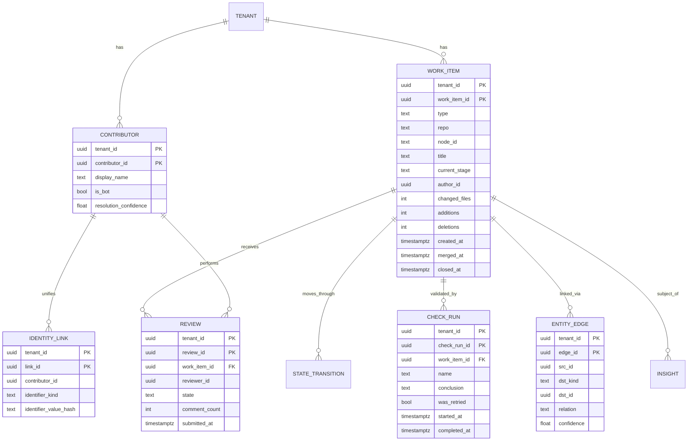
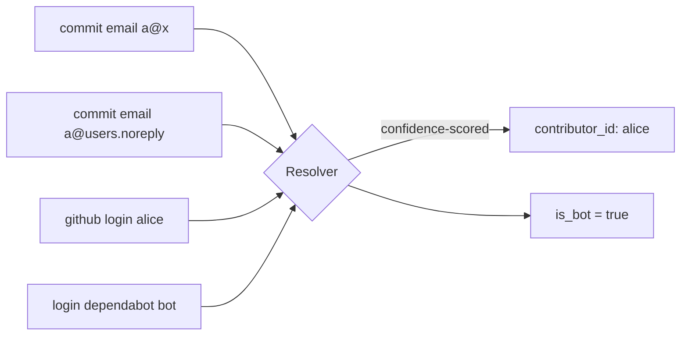

# DATA-MODEL — Dev Intelligence Platform (GitHub-only)

Canonical model (write side), GitHub event mapping, the intra-GitHub entity graph, contributor identity resolution, and storage mapping. SQL is PostgreSQL/Citus; every distributed table carries `tenant_id` as shard key + first PK column. RLS on every table.

## 1. ER overview



## 2. Canonical tables (write model)

```sql
-- All distributed by tenant_id (Citus). RLS enabled on every table.

CREATE TABLE work_item (
  tenant_id     uuid NOT NULL,
  work_item_id  uuid NOT NULL DEFAULT gen_random_uuid(),
  type          text NOT NULL CHECK (type IN ('pr','issue','commit')),
  repo          text NOT NULL,
  node_id       text NOT NULL,            -- GitHub global node id
  number        int,                       -- PR/issue number
  title         text,
  status        text,                      -- open|closed|merged
  current_stage text,                      -- open|in_review|changes_requested|approved|merged|closed
  author_id     uuid,                      -- resolved contributor
  changed_files int, additions int, deletions int,   -- PR size signals
  is_revert     bool DEFAULT false,        -- detected revert/hotfix
  created_at    timestamptz NOT NULL,
  merged_at     timestamptz,
  closed_at     timestamptz,
  raw_ref       text,                      -- S3 key
  PRIMARY KEY (tenant_id, work_item_id),
  UNIQUE (tenant_id, repo, type, node_id)
);

CREATE TABLE review (
  tenant_id     uuid NOT NULL,
  review_id     uuid NOT NULL DEFAULT gen_random_uuid(),
  work_item_id  uuid NOT NULL,
  reviewer_id   uuid NOT NULL,
  state         text NOT NULL,             -- approved|changes_requested|commented|dismissed
  comment_count int  NOT NULL DEFAULT 0,   -- review depth signal
  submitted_at  timestamptz NOT NULL,
  PRIMARY KEY (tenant_id, review_id)
);

CREATE TABLE check_run (
  tenant_id     uuid NOT NULL,
  check_run_id  uuid NOT NULL DEFAULT gen_random_uuid(),
  work_item_id  uuid,                       -- associated PR (via head SHA)
  head_sha      text NOT NULL,
  name          text NOT NULL,
  conclusion    text,                       -- success|failure|cancelled|timed_out
  was_retried   bool NOT NULL DEFAULT false,-- flaky-CI signal
  started_at    timestamptz, completed_at timestamptz,
  PRIMARY KEY (tenant_id, check_run_id)
);

CREATE TABLE contributor (
  tenant_id     uuid NOT NULL,
  contributor_id uuid NOT NULL DEFAULT gen_random_uuid(),
  display_name  text,
  is_bot        bool NOT NULL DEFAULT false,
  team_id       uuid,
  resolution_confidence float,             -- identity resolution confidence
  PRIMARY KEY (tenant_id, contributor_id)
);

CREATE TABLE identity_link (   -- maps raw identifiers -> a unified contributor
  tenant_id        uuid NOT NULL,
  link_id          uuid NOT NULL DEFAULT gen_random_uuid(),
  contributor_id   uuid NOT NULL,
  identifier_kind  text NOT NULL,          -- commit_email|github_login|noreply
  identifier_value_hash text NOT NULL,     -- hashed; raw PII not stored
  confidence       float NOT NULL,
  PRIMARY KEY (tenant_id, link_id),
  UNIQUE (tenant_id, identifier_kind, identifier_value_hash)
);

CREATE TABLE state_transition (
  tenant_id     uuid NOT NULL,
  transition_id uuid NOT NULL DEFAULT gen_random_uuid(),
  work_item_id  uuid NOT NULL,
  from_stage    text, to_stage text NOT NULL,
  occurred_at   timestamptz NOT NULL,
  idle_before   interval,                  -- computed by Flink
  PRIMARY KEY (tenant_id, transition_id)
);

CREATE TABLE entity_edge (     -- intra-GitHub graph
  tenant_id  uuid NOT NULL,
  edge_id    uuid NOT NULL DEFAULT gen_random_uuid(),
  src_id     uuid NOT NULL,
  dst_kind   text NOT NULL,                -- work_item|check_run
  dst_id     uuid NOT NULL,
  relation   text NOT NULL,                -- contains_commit|closes|references|validated_by
  confidence float NOT NULL,
  method     text,                          -- pr_commit_list|closes_kw|trailer|head_sha|timeline_xref
  PRIMARY KEY (tenant_id, edge_id)
);

CREATE TABLE insight (
  tenant_id   uuid NOT NULL,
  insight_id  uuid NOT NULL DEFAULT gen_random_uuid(),
  kind        text NOT NULL,    -- bottleneck|recurring_blocker|review_health|ci_reliability|collab|change_risk|ai_authorship
  subject_ref jsonb NOT NULL,
  severity    text NOT NULL, confidence float NOT NULL,
  scope       text NOT NULL,    -- portfolio|team|individual
  evidence    jsonb NOT NULL,   -- citations: [{kind,id,source_url}]
  model_version text, prompt_version text,
  created_at  timestamptz NOT NULL DEFAULT now(),
  state       text NOT NULL DEFAULT 'active',
  PRIMARY KEY (tenant_id, insight_id)
);
```

## 3. GitHub event → canonical mapping

| GitHub webhook / entity | Canonical event(s) | Pillar inputs |
|-------------------------|--------------------|---------------|
| `pull_request` (opened/closed/merged) | `work_item.created/updated/state_changed` | flow, size |
| `pull_request_review` | `review.submitted` | review health |
| `pull_request_review_comment`, `issue_comment` | `comment.added` | review depth, blockers (AI) |
| `push` / commits | `commit.observed` | identity, revert detection |
| `issues` (opened/closed/reopened/labeled) | `work_item.*`, `label.changed` | blockers, rework |
| `check_run` / `check_suite` / `status` | `check.completed` | CI reliability, flake |
| `deployment` / `release` *(capability-gated)* | `deploy.observed` | DORA (only if present) |

Canonical envelope: `{event_id, tenant_id, type, source:"github", source_event_id, occurred_at, version, payload}`. Idempotency on `(source_event_id)` / `(repo, node_id, updated_at)`.

## 4. Contributor identity resolution


- Inputs: commit author/committer emails, GitHub login from PR/review/issue actors, noreply addresses (`<id>+<login>@users.noreply.github.com` → login).
- Strategy: deterministic joins first (login match, noreply→login), then fuzzy (shared verified email) with confidence; bots classified by `[bot]` suffix / known app ids.
- Deterministic + re-runnable; low-confidence merges flagged for override (FR-3.4/3.6).

## 5. Storage mapping (polyglot persistence)

| Data | Store | Why |
|------|-------|-----|
| Raw GitHub payloads | S3 / MinIO | Immutable, replay + lake. |
| Canonical entities (write) | Postgres + Citus (tenant-sharded) | Transactional source of truth. |
| Entity graph + identity map | Postgres (indexed adjacency) | Bounded fan-out; no separate graph DB in MVP (ADR-004). |
| Flow / CI / review metrics | ClickHouse | Columnar windowed analytics. |
| Drill-down views | Postgres read replicas | Cheap replica-scaled reads. |
| Full-text | OpenSearch | Search PR/issue/review bodies. |
| Hot responses | Redis | Read-model + LLM response cache. |
| Embeddings | pgvector → Qdrant | RAG, per-tenant namespace. |

## 6. Indexing & partitioning

- `work_item (tenant_id, repo, type, node_id)` unique → idempotency.
- `state_transition (tenant_id, work_item_id, occurred_at)` → cycle-time scans.
- `check_run (tenant_id, name, conclusion, started_at)` → flake detection.
- `entity_edge (tenant_id, src_id)` and `(tenant_id, dst_id)` → graph traversal both ways.
- `identity_link (tenant_id, identifier_kind, identifier_value_hash)` unique → resolution.
- ClickHouse metrics partitioned by month, ordered by `(tenant_id, repo, stage, day)`.
- RLS: `USING (tenant_id = current_setting('app.tenant_id')::uuid)` on every table.
