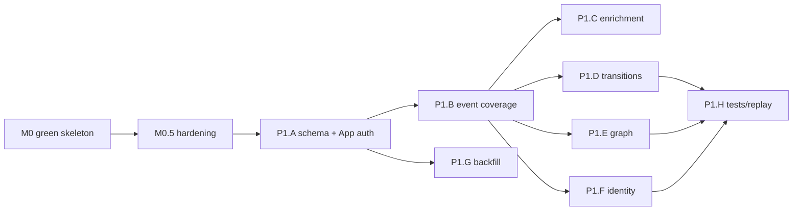

# Implementation Plan — through Phase 1

Task-level plan picking up from the Phase 0 walking skeleton. Covers: **M0** green/run the
skeleton, **M0.5** Phase-0 hardening, then **Phase 1** (full GitHub ingestion + correlation +
identity resolution). Beyond Phase 1, see `ROADMAP.md`.

Each task notes acceptance criteria and the requirement IDs it satisfies. `[ ]` = todo.

> **Design guardrail — "AI earns its place" (ADR-011).** Nothing in M0–Phase 1 uses an LLM (this is
> ingestion/correlation/identity — all deterministic). When the AI layer lands (Phase 3), an LLM is
> added only where the value is locked in language/code semantics and the output is a
> flag/label/summary — never a trusted number, a query, or an action. Numbers stay deterministic or
> classical ML. The first genuine-LLM feature is **semantic change understanding** (AI-11:
> grounded change summary + intent-vs-diff divergence), which depends on the diff that P1.C
> enrichment fetches — so the ingestion work below is its prerequisite.

---

## Current state (what the scaffold gives us)

Built: local stack (`docker-compose.dev.yml`), `work_item` migration + RLS + seed, canonical
event schema, libs (`events`, `tenancy`, `connector`+`github`, `kafka`, `observability`),
`webhook-gateway` + `normalizer`, red-team RLS test, CI, Makefile, sample webhook.

Not yet done: never compiled/run; only `pull_request` events; no enrichment, identity, graph,
or backfill; only `work_item` table exists.

---

## M0 — Green the skeleton (verification first)

**Goal:** prove the Phase 0 exit criteria on a real machine before adding anything.

- [x] `make tidy` — resolve deps, generate `go.sum`. Fix any version drift in `go.mod`.
- [x] `make build && make vet` — fix compile/vet errors (the scaffold was authored without a local toolchain).
- [x] `make up` — stack healthy (Redpanda, Postgres/Citus, Redis, SeaweedFS); confirm migrations applied.
- [x] Run `normalizer` + `webhook-gateway`; `make send-sample`.
- [x] Verify the `acme/app #482` row lands, scoped to the seeded tenant; same `trace_id` in both service logs.
- [x] `make test-isolation` passes (RLS gate green).
- [x] Commit a known-good baseline + tag (`m0-walking-skeleton`).

**Done when:** a signed sample webhook becomes a tenant-scoped `work_item`, the isolation test
passes, and CI is green. (Phase 0 exit: FR-1.1–1.4, FR-2.1–2.5, NFR-7.2)

---

## M0.5 — Phase-0 hardening

Small foundation-completing tasks before breadth.

- [x] **Raw archive to S3/SeaweedFS.** A separate `archiver` consumer (own consumer group) writes
      every `raw.github` payload to SeaweedFS keyed `raw/github/<tenant>/<date>/<delivery>.json`
      (unknown installs → `_unresolved/<id>`, never dropped). `PutIfAbsent` makes it idempotent.
      Kept off the gateway hot path. Enables replay (ADR-010). *(FR-2.4)*
- [x] **Delivery-id dedup.** `processed_delivery` table (tenant-scoped, RLS FORCE); normalizer marks
      the delivery in the **same tx** as the work_item write, so a redelivery is a provable no-op
      (no re-emit), not just upsert-absorbed. *(FR-2.2, ADR-010)*
- [x] **Transactional outbox.** The canonical event is staged in an `outbox` table inside that same
      tx (dedup mark + work_item + event commit atomically), and a separate `outbox-relay` drains it
      to Kafka at-least-once. Closes the dual-write window that dedup would otherwise turn into a lost
      emit; the relay runs as a dedicated `devintel_relay` role scoped to the outbox. *(ADR-012)*
- [x] **Dead-letter + retry.** Normalizer dead-letters permanently-bad messages (undecodable/invalid
      payloads) to `raw.github.dlq` then commits; transient failures (DB/Kafka) retry with capped
      exponential backoff. Fixed the prior busy-loop-on-error. *(AI/ingest robustness)*
- [x] **Unit tests.** `connector/github` normalization (table-driven: opened/merged/closed/reopened/
      skip/missing-install/malformed); gateway `validSignature`; `config` parsing; normalizer
      `backoff`/error-classification. No infra needed. (`tenancy.WithTenant` stays covered by the
      red-team isolation test, which needs Postgres.)
- [x] **Config + graceful shutdown.** Env parsing centralized in `libs/go/config`; gateway drains via
      `http.Server.Shutdown` on SIGTERM; archiver/normalizer exit cleanly on `signal.NotifyContext`.
- [ ] **OTel (optional now).** Swap the slog trace-id for real OpenTelemetry spans exported via OTLP
      (the seam is isolated in `libs/go/observability`). **Deferred** to keep momentum. *(NFR-7.2)*

**Done when:** raw events are archived + replayable, redeliveries are idempotent, and unit tests cover the spine.

---

## Phase 1 — Ingestion depth + correlation + identity

Ordered by dependency. **P1.A is a prerequisite for everything else.**

### P1.A — Schema + GitHub App foundation
- [x] **Migrations for the rest of the write model** with RLS (FORCE) on each: `review`,
      `check_run`, `contributor`, `identity_link`, `state_transition`, `entity_edge` (+ `repo_capability`),
      schemas per `DATA-MODEL.md`. Indexes from §6; idempotency uniques per ADR-010. Red-team test
      extended (table-driven) to cover every new table. `db/migrations/0006_write_model.sql`. *(FR-3.1)*
- [x] **GitHub App installation auth.** `libs/go/githubapp`: mints the app JWT (RS256, hand-rolled —
      no JWT dep) and exchanges it for short-lived installation tokens, cached + refreshed per
      installation (per-install lock coalesces refreshes). Private key loaded from PEM (PKCS#1/#8);
      Vault is the prod source, file path the dev seam. *(NFR-6.2)*
- [x] **Rate-limit budgeting.** Per-installation `Budget` (REST + GraphQL pools) fed from
      `X-RateLimit-*` headers; `Reserve` defers calls at a safety floor until the window resets, with
      optimistic local debit between header refreshes. `Registry` holds one budget per install. *(FR-2.3)*
- [x] **Capability detection.** `Client.DetectRepoCapabilities` probes deployments/releases via the
      budgeted, authenticated client; `PersistRepoCapability` upserts per-tenant flags into
      `repo_capability` (gates DORA). *(FR-2.10)*

**Done when:** all canonical entities have tables + RLS, and the connector can authenticate and
call the GitHub API within budget. ✅ — live GitHub calls await a registered App + token (no creds in
dev); the auth/budget/detection logic is unit-tested against an injected transport + clock.

### P1.B — Full event coverage
Extend `connector/github` + `normalizer` from PR-only to the full STRONG signal set.
- [x] Add canonical event types + payloads: `review.submitted`, `comment.added`, `commit.observed`,
      `work_item.*` for issues, `check.completed`. (`events.EventType` constants + per-entity payload
      builders in the normalizer; the schema enum already listed them.) *(`schemas/events`)*
- [x] Handle webhooks: `pull_request_review`, `pull_request_review_comment`, `issue_comment`,
      `push`, `issues`, `check_run`/`status`. Map each to canonical + persist (`review`, `check_run`,
      work items for issues/commits). `check_suite` is recognized but skipped (aggregate of
      `check_run` — persisting it would double-count CI). Comments have no table (DATA-MODEL §2): they
      emit `comment.added` for downstream. *(FR-2.1, FR-2.5)*
- [x] Idempotent upserts on each new entity (keys per `DATA-MODEL.md`): `review`/`check_run` on
      `(tenant, source_id)`, work items on `(tenant, repo, type, node_id)`. Each emitted canonical
      event carries the entity's natural id as `source_event_id` (a push of N commits → N
      independently-idempotent events). *(ADR-010)*

**Done when:** a repo's PRs, reviews, comments, commits, issues, and checks all land as canonical
entities, tenant-scoped. ✅ — connector dispatches all STRONG event types; normalizer persists
multi-entity in one atomic tenant-scoped tx (delivery dedup + upserts + outbox). A review ensures its
parent PR exists (handles out-of-order delivery) and resolves the reviewer to a contributor via the
deterministic login-match subset of P1.F identity resolution; check_run `work_item_id` is left NULL
for head-SHA correlation in P1.E. Connector coverage is table-tested across every event type.

### P1.C — GraphQL enrichment (`connector-github` service)
Webhooks omit fields we need (e.g. `changed_files`, full diffs context).
- [x] Stood up `services/connector-github`: consumes `raw.github`, enriches `pull_request` events via
      a single batched GraphQL query (`libs/go/githubapp.EnrichPullRequest` — authoritative
      additions/deletions/changedFiles, commit OIDs, per-file churn), injects an `_enrichment` block,
      and emits to `enriched.github`. The normalizer now consumes `enriched.github`. Respects the P1.A
      rate budget (GraphQL pool via `Client.GraphQL`, observing `rateLimit{}` cost). **Degraded mode
      (FR-2.8):** no creds / non-PR event / GraphQL error / exhausted budget → pass through unchanged,
      stamped with an `enrich-status` header, so the pipeline never stalls. *(FR-2.1)*
- [x] Backfill-vs-live ordering: the enricher stamps `occurred-at` (source PR `updated_at`/`created_at`)
      as a header, and canonical events already carry a source-derived `occurred_at` (P1.B), not arrival.
- [x] Per-file **patches** surfaced via `Client.FetchPullRequestPatches` (REST — GraphQL can't return
      patch text), size-capped, behind `ENRICH_PATCHES` (off by default to keep the log lean; Phase-3
      AI-11 turns it on). Commit OIDs + file churn ride in the canonical PR payload for P1.E/Phase-3.

**Done when:** enriched PRs carry size/review metadata the raw webhook lacked. ✅ — GraphQL client +
enrichment are unit-tested against an injected transport; the enricher's merge/pass-through/skip paths
are unit-tested; the connector reads the `_enrichment` block (authoritative counts override the
webhook's). Live GraphQL awaits a registered App (same posture as P1.A).

> Forward-pointer: the **diff/patch** fetched here (REST, `ENRICH_PATCHES`) is the input the Phase-3
> semantic change understanding worker (AI-11: change summary + intent-vs-diff divergence) consumes.
> Enrichment surfaces per-file patches, not just counts.

### P1.D — State-transition derivation
Implement the `STATE-MACHINE.md` FSM.
- [ ] Derive `state_transition` rows from event timelines (per the transition table); compute
      `idle_before` and time-in-stage. *(FR-4.1 inputs)*
- [ ] Emit `agg.cycle_time` / `agg.idle_time` events for downstream projectors (Phase 2).
- [ ] **Engine choice:** start in **Kafka Streams** (simpler ops) per ADR-005; migrate hot paths
      to Flink if/when state size demands. Keep the job logic engine-agnostic where feasible.

**Done when:** every work item has an ordered, replayable transition timeline with idle/cycle computed.

### P1.E — Correlation: entity graph
- [ ] Build `entity_edge` links: PR↔commits (PR commit list), PR↔issue (`closes #`, `Refs:`
      trailers, timeline cross-refs), commit↔check (head SHA), review↔PR. Confidence-scored. *(FR-3.2, FR-3.4)*
- [ ] Deterministic + re-runnable (replay rebuilds identical edges). *(NFR-3.5, ADR-010)*

**Done when:** querying a PR returns its linked commits, issue(s), reviews, and checks.

### P1.F — Contributor identity resolution
- [ ] Resolve actors across commit emails, GitHub logins, and noreply addresses into a stable
      `contributor_id`; populate `identity_link` with confidence; classify bots (`[bot]`, known apps). *(FR-3.3)*
- [ ] Deterministic joins first (login, noreply→login), then fuzzy (shared verified email);
      low-confidence merges flagged for later override. *(FR-3.4)*

**Done when:** one human is unified across multiple emails/logins; bots are flagged and excluded
from human metrics.

### P1.G — API backfill (Temporal)
- [ ] Add Temporal to the stack + a `backfill` workflow: crawl a tenant's repo history via the
      **REST/GraphQL API** (the source of truth for private repos), feed the same normalizer path.
      Resumable + checkpointed; respects the P1.A rate budget. *(FR-2.6, FR-2.7)*
- [ ] Idempotent against live ingestion (backfill + webhooks converge, no double-count). *(ADR-010)*
- [ ] **GH Archive is optional and public-only**: for *public* tenant repos (or demo/benchmark/
      synthetic-scale data), load from GH Archive to accelerate the crawl, reconciled against API
      truth. It carries only the public timeline, so it is never the path for private repos.

**Done when:** onboarding a repo backfills its history via the rate-budgeted API without exhausting
limits, and backfilled + live data are consistent.

### P1.H — Cross-cutting (ongoing)
- [ ] **Replay test:** drop the graph/identity state, replay the log, assert identical rebuild. *(ADR-010)*
- [ ] **Correctness tests:** golden fixtures for correlation (known PR↔issue links) and identity
      resolution (known multi-email contributor).
- [ ] **Connector health + token refresh alerts.** *(FR-2.8)*
- [ ] Extend CI: spin up Redpanda + Postgres, run an end-to-end ingest→graph integration test.

**Phase 1 exit (ROADMAP):** PRs link to their commits/issues/checks; a contributor is unified
across emails/logins; bots flagged. (FR-2.6–2.10, FR-3.1–3.5)

---

## Suggested sequence

## Key decisions to make as you go

- **Kafka Streams vs Flink (P1.D/E).** Start Streams to avoid Flink ops early; revisit when state
  grows (ADR-005). Don't stand up Flink before you feel the pain.
- **Enrichment placement (P1.C).** Separate `connector-github` service (per REPO-LAYOUT) vs. folding
  into the normalizer. Separate is cleaner for rate-budget isolation; costs one more deployable.
- **Identity confidence threshold (P1.F).** Where to auto-merge vs. flag for review — start
  conservative; over-merging two people is worse than under-merging.

## Definition of done (Phase 1)

A tenant connects a GitHub org → history backfills → live events flow → PRs/issues/reviews/commits/
checks are persisted, correlated into a graph, and attributed to resolved contributors — all
tenant-isolated, idempotent, and replayable. That's the substrate Phase 2 projects into dashboards.
