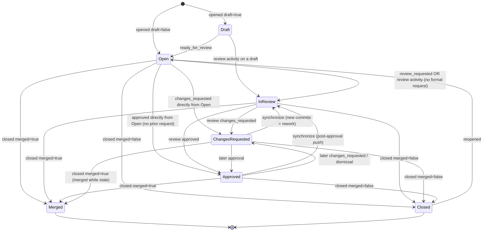
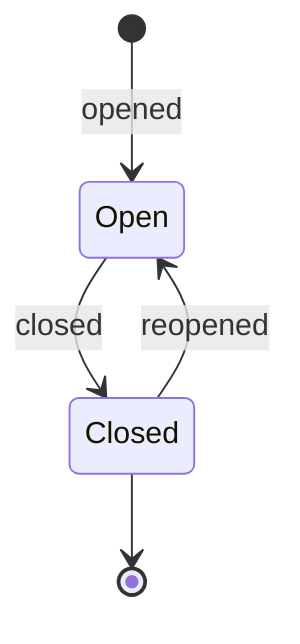

# STATE-MACHINE — Work-item lifecycle

The `current_stage` finite-state machine. This is the **spine of every Pillar-1 metric** —
cycle time, time-in-stage, idle time, and "stuck" detection are all derived from transitions
through these states. Defining it precisely here keeps the connector, the Flink aggregations,
and the projections in agreement.

Driven **only by STRONG GitHub signals** (PR/issue/review events). No Projects v2 / Milestones
inputs (per the signal-confidence principle).

## 1. PR lifecycle

## 2. Issue lifecycle

Issues have no review sub-states; they are deliberately simple.

## 2a. Precedence rules (the FSM is driven by observed events, not just requests)

A request-only model (`Open → InReview` *only* on `review_requested`) undercounts real PRs: many
are reviewed with no formal request, use CODEOWNERS auto-requests, are approved straight from Open,
or merge from a stale `ChangesRequested`. So the stage is derived by **precedence over the observed
event set**, not a single trigger. On each event, recompute the target stage by the first matching
rule (highest precedence first):

1. **Terminal wins.** `closed merged=true` → `Merged`; `closed merged=false` → `Closed`
   (from any non-terminal stage). `reopened` → `Open`.
2. **Latest review verdict wins.** The most recent *non-dismissed* review submission sets:
   `approved` → `Approved`; `changes_requested` → `ChangesRequested`. A `review_dismissed` removes
   that verdict and falls back to rule 3/4.
3. **Active review.** Any review activity — a submitted review (incl. `commented`), a review comment,
   or a pending **requested reviewer** (explicit or CODEOWNERS auto-request) — means the PR is under
   review → at least `InReview`. A formal `review_requested` is **sufficient but not necessary**.
4. **Rework on push.** A `synchronize` (new commits) **after** an `Approved`/`ChangesRequested`
   verdict returns the PR to `InReview` and increments the rework counter (Pillar 4).
5. **Draft gating.** While `draft=true` the PR is `Draft` (review-wait clock not started), even if
   review activity occurs; `ready_for_review` opens the review-wait window. Draft time is excluded
   from review-wait.
6. **Default.** No review signal yet and not draft → `Open`.

**Inputs considered (in precedence):** merge/close state → latest review verdict → review activity /
requested reviewers (incl. CODEOWNERS) → draft state → pushes/mergeability. Bot actors
(`is_bot=true`) drive stage transitions but are excluded from review-wait and reviewer-load metrics.
Event ordering is by `occurred_at`, not arrival (handles redelivery / backfill-vs-live).

## 3. Transition table (PR)

| From | To | GitHub trigger | Notes / metric meaning |
|------|----|----------------|------------------------|
| — | Draft | `pull_request.opened` (draft=true) | Work started, not ready. Draft time excluded from review-wait. |
| — | Open | `pull_request.opened` (draft=false) | Ready, awaiting review request. |
| Draft | Open | `pull_request.ready_for_review` | Start of the "open, no review yet" idle window. |
| Open | InReview | `pull_request.review_requested` **or** any review activity / CODEOWNERS auto-request (precedence rule 3) | First-review-wait ends. Request is sufficient, not necessary. |
| Open | Approved / ChangesRequested | `pull_request_review.submitted` with no prior request | Direct review from Open (rule 2). |
| ChangesRequested / Approved | Merged | `pull_request.closed` (merged=true) | Merged while stale (rule 1). |
| InReview | ChangesRequested | `pull_request_review.submitted` state=`changes_requested` | Enters rework. |
| InReview | Approved | `pull_request_review.submitted` state=`approved` | Ready to merge. |
| ChangesRequested | InReview | `pull_request.synchronize` (new commits) | **Rework loop** — count of these = rework signal (Pillar 4). |
| Approved | InReview | `pull_request.synchronize` | Post-approval push; re-review needed. |
| Open / InReview / Approved | Merged | `pull_request.closed` (merged=true) | Cycle complete. |
| Open / InReview / ChangesRequested | Closed | `pull_request.closed` (merged=false) | Abandoned/superseded. |
| Closed | Open | `pull_request.reopened` | Resets to Open; a reopen counts toward churn. |

`review_dismissed` returns an Approved/ChangesRequested PR to `InReview`. Bot/automation actors
(resolved via identity resolution, `is_bot=true`) are excluded from review-wait and reviewer-load
metrics but still drive stage transitions.

## 4. Derived metrics

For each work item, transitions form an ordered timeline. From it:

- **Time-in-stage(s)** = `next_transition.occurred_at − enter_stage.occurred_at`. Materialized
  on the transition as `idle_before` (time the item sat in the prior stage before this transition).
- **Cycle time** = `merged_at − created_at` (or first-`Open` for drafts), optionally minus draft time.
- **Review wait** = time in `Open` before first `InReview`.
- **Rework time** = cumulative time in `ChangesRequested` + `InReview` after the first
  `ChangesRequested`; **rework loops** = count of `ChangesRequested → InReview` edges.
- **Stuck / stale** = currently in a non-terminal stage with time-in-stage above the
  team/historical percentile baseline (outlier detection, not a fixed threshold).
- **Bottleneck** (Pillar 1) = a stage whose median/p90 time-in-stage exceeds baseline across many items.

## 5. Implementation notes

- The connector maps each GitHub event to a `(to_stage, trigger)`; the Flink aggregation computes
  `idle_before` and emits `state_transition` rows (see DATA-MODEL `state_transition`).
- The FSM is **append-only and replayable**: re-running the event log reproduces the identical
  transition timeline (ADR-003 / ADR-010).
- Out-of-order events (webhook redelivery, backfill vs. live) are ordered by event `occurred_at`,
  not arrival time; Flink uses event-time windows so late events slot correctly.
- Unknown/unhandled actions are recorded as `work_item.updated` with no stage change (no spurious
  transition).
